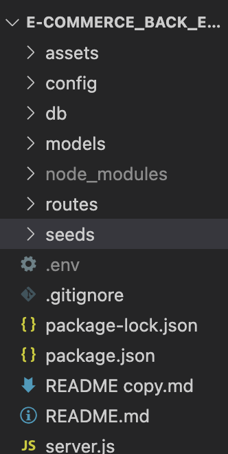

# E-Commerce_Back_End_ORM

**What does this application do and why**

* As an manager of an internet retail company, it's important to use good technologies that track what will be available in our store using a database
* This app builds the routes on the back end to access data from a database or change the data in some way: creating new items for the database, updating items in the database, and deleting things from the database 
* This application uses different types of api requests to access and change a given database, which will be a good basis for the future website's front-end

**How the application is organized**

E-Commerce Back End ORM is organized into the following files:

**Installation**

* open integrated terminal from server.js
* install necessary applications by using "npm i" in the command line
* run mySQL and upload the schema.sql file 
* exit mySQl and run the seeds/index.js to seed the database

**Step by step on how to run the application**

* from the integrated terminal, start the server on the local host
* use third party application to test different api routes to get/manipulate the data from the database

**What the application looks like**

Here is a video showing the use of the application
[Link to Video of Application]https://watch.screencastify.com/v/n8x11lR0wjUYLJG0bdJ8

**Link to deployed version of Ahmed's Portfolio**

GitHub Repository: 

**Technologies Used** 
* javascript
* Express
* inquirer
* MySQL
* Sequelize
* Api routes
